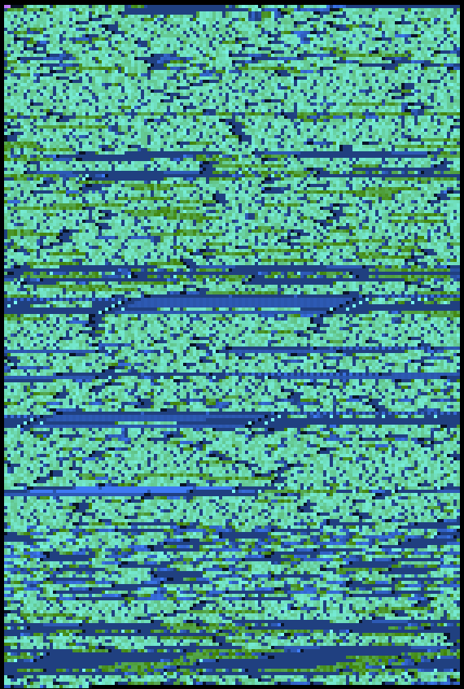
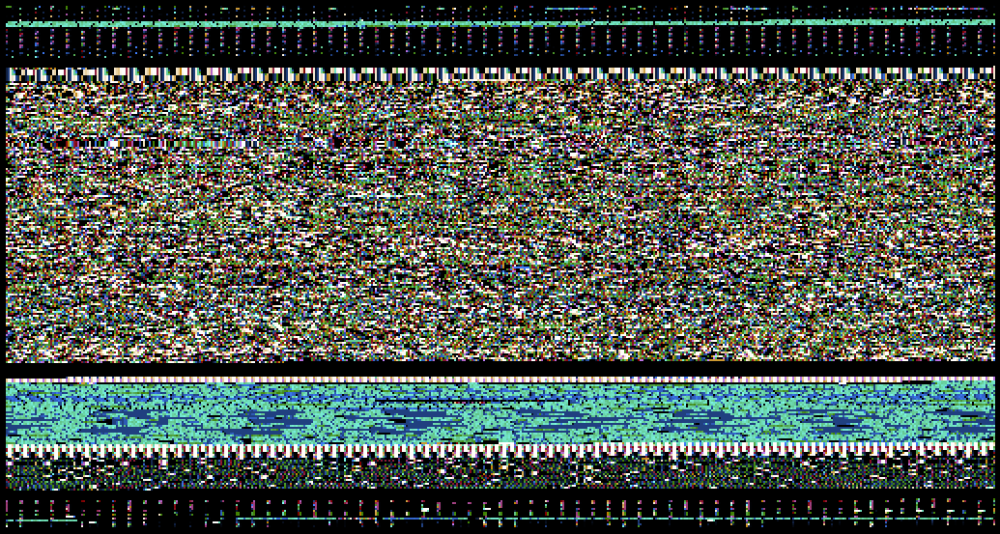
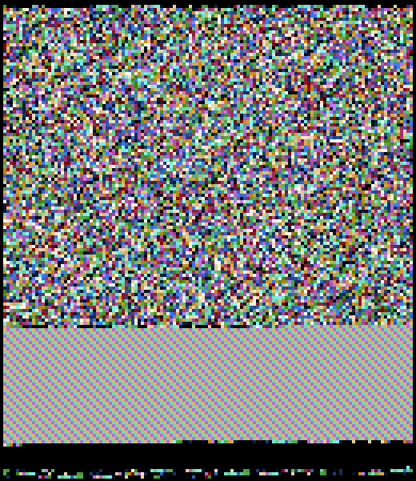

binary collections.

| [png](./png)            |
|-------------------------|
|  |

| [jpeg](./jpeg)           |
|--------------------------|
|  |

| [tiff](./tiff)           |
|--------------------------|
|  |

| [go_x86_64](./go_x86_64)      |
|-------------------------------|
|  |

| [ja_shift_jis](./ja_shift_jis)   |
|----------------------------------|
|  |

| [en_utf8](./en_utf8)   |
|----------------------------------|
|  |

| [ls](./ls)   |
|----------------------------------|
|  |

| [zip](./zip)   |
|----------------------------------|
|  |

## generate

```
$ binocle test.png
```
